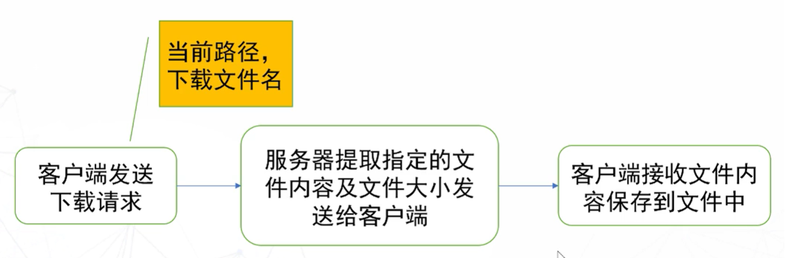

# 项目实战--网盘系统


背景：随着时代的发展，业务数据量的剧增及移动办公需求，人们对内存的需求越来越强，传统的存储产品，在容量及携带型日益不能满足人工的工作需求，网盘再此背景下应运而生。网盘是能够提供文件同步，备份及共享等服务的网络云存储平台。可以随时随地的把照片、音乐、视频、文档等轻松地保存到网盘，无须担心文件丢失。通过网盘，用户可以多终端上传和下载、管理、分享文件，一切就变得轻而易举。

描述：随时随地上传下载、编辑和分享**文件**；搜索好友、加好友、**好友**聊天等

要点：

* 多线程。考虑多文件同时上传、信息输入和接受同时进行

* TCP Socket网络编程。用于客户端登录及互联网向服务端传输
* SQLite3数据库。信息在服务端的暂存
* 面向对象编程。通过设计不同的实体对象实现项目开发


##安装

step1：SQLite3[官网](https://www.sqlite.org/download.html)下载：适用于 Windows 的预编译二进制文件[sqlite-dll-win64-x64-3400100.zip](https://www.sqlite.org/2022/sqlite-dll-win64-x64-3400100.zip)、[sqlite-tools-win32-x86-3400100.zip](https://www.sqlite.org/2022/sqlite-tools-win32-x86-3400100.zip)

step2：小文件解压至同一文件夹；进入我的电脑-右击-属性-高级系统设置-环境变量-编辑系统环境变量中的path-写入文件夹位置-重启系统使其生效；测试-终端输入sqlite3-进入sqlite-输入.quit退出


## 设计

Qt网盘系统主要由Qt creator实现了客户端/服务器的设计，调用了tckSocket发送数据进行两端信息往来

使用了UI控件、socket网络编程、界面切换等一些基础的功能。服务器和多客户端之间通过QList链表存放对应的socket连接，负责与不同的客户端交互

UI控件通过connect连接信号槽和处理函数处理

数据库信息通过QSqlQuery的exec函数获取SQL查询结果并处理对应位置的value进行处理

界面切换：通过show和hide进行界面的切换、增加和关闭；也包括点击图书、好友等控件后执行界面处理的命令

### 一、数据库

1. 指定位置创建/打开数据表

   > sqlite3 ./Desktop/cloud.db

2. 创建用户信息表

   

   > create table usrInfo(id integer primary key autoincrement,
   >
   > name varchar(32),
   >
   > pwd varchar(32));
   >
   > .tables

3. 创建用户好友表

   

   > create table friendInfo(id integer not null,
   >
   > friendId integer not null,
   >
   > primary key(id,friendId));
   >
   > .tables

4. 测试

   > insert into usrInfo(name, pwd) values('jack', 'jack'),
   >
   > ('rose', 'rose'), ('lucy','lucy');
   >
   > select * from usrInfo;
   >
   > 
   >
   > 1|jack|jack
   >
   > 2|rose|rose
   >
   > 3|lucy|lucy 


常用

>.tables	查询数据库内成员
>
>sqlite3 cloud.db	进入数据库
>
>select * from usrInfo;	查询用户
>
>update usrInfo set online=0;	用户状态重置
>
>delete from usrInfo where name='111';	用户信息删除
>
>insert into usrInfo(name,pwd) values('111','111');	用户添加
>
>insert into friend (id,friendId) values(1,2),(1,3),(2,3);


### 二、客户端

客户端中承载了输入的ui界面处理、信号发送、接收后修改ui界面等功能；

将服务器IP和PORT信息**填入配置文件**中；将配置文件作为资源文件**添加到资源文件**中；程序**运行时加载**配置文件中的数据。

#### 1. QT下载：

* 官网[下载]([qt-opensource-windows-x86-5.12.12.exe](https://download.qt.io/archive/qt/5.12/5.12.12/qt-opensource-windows-x86-5.12.12.exe)) 
* 账号[注册](https://login.qt.io/login) 
* 选择组件[安装](https://blog.csdn.net/weixin_46822345/article/details/124903061) 

#### 2. 项目实现

* 新建文件或项目--Application(Qt)--QtWidgets Application--默认--Base class(Qwidget)--Class name(自定义)--默认--运行出现结果
* 添加配置文件--右键项目名--add new--Qt--Qt Resourse File--添加前缀文件夹-右键加入config文件
* 编写TcpClient项目，将配置文件解析成数据并输出

#### 3. ui界面

* 基础控件

  Line edit 编辑控件

  Push Button 发送控件：修改右下角objectName为send_pb，右键--跳转到槽--clicked控件

  Text edit 文本控件

* 操作：发射控件和文本控件水平对齐，与编辑控件垂直对齐，水平对齐填充

* 错误：找不到ui控件，项目--取消勾选shadow build--编译运行本项目(更新了debug中的ui.h文件)

#### 4. 账号操作


密码设置--echoMode--Password


#### 5. 添加用户界面

**显示在线用户界面**

* 客户端--Add New--Qt 设计师界面--widget--Class name修改成Online--设计ui--完成

**显示聊天信息好友列表**

* 客户端--Add New--C++类--Class name改成Friend; Base class改成Qwight--以代码实现ui界面布局

**friend中实现显示在线用户**

* 加入Online库函数--布局在线用户界面并隐藏--设计点击隐藏和点击展示函数并连接信号槽

**图书操作界面**

* 客户端--Add New--C++类--Class name改成Book; Base class改成Qwight

**登录跳转**

* 操作界面加入好友和图书--每次只能显示一个

* 登录成功--跳转到好友图书界面(隐藏登录界面)

#### 6. 显示在线用户


**socket传参**

* 通过TcpClient设计成单例模式，添加获取TcpSocket的方法，点击显示在线用户时发送请求
* 在服务器接受请求后发送数据及回复信号
* 客户端接收后--online中添加显示功能

#### 7.查找用户

* 客户端产生一个槽函数，好友界面关联信号槽，设计实际搜索函数
* 客户端数据打包发送，服务器用数据库收集信息，反馈后在客户端显示


### 三、服务器

服务器中主要承载的是数据库的连接，通过接收客户端的信号对数据库直接操作，并返回处理结果用于客户端的使用

#### 1 搭建


* 新建TcpServer项目--添加C++类mytcpserver--重复添加配置文件步骤--TcpServer监听及接收客户端连接

* 重复加载配置信息的代码--添加监听--运行服务器--运行客户端--两者都连接成功

  

#### 2 数据库实现

* 进入项目目录，创建sqlite3 XXX.db

> create table usrInfo(id integer primary key autoincrement,
>
> name varchar(32) unique,	账户唯一
>
> pwd varchar(32),
>
> online integer default 0);		默认不在线
>
> create table friend(id integer, friendId integer,
>
> primary key(id, friendId));
>
> .tables
>
> .quit

* 服务器端添加OpeDB class，基类选择QObject
* 放入数据库，构造初始化函数并返回能否读取的结果


### 四、通讯协议设计

通讯协议是连接客户端和服务器的实际准则，需要保持两者的一致性使传输过程达到统一

* 弹性结构体：借助弹性数组，由数据大小开辟内存空间

* 通讯协议设计：总的消息大小、消息类型、实际消息大小、实际消息

  在客户端处添加协议数据单元，通过ui控件交互信息；

  在服务器处添加信号接收和数据处理

* 数据收发测试


### 五、好友交互

主要由客户端显示，设计ui界面，集中的为friend模块和tcpclient接收消息模块

#### 1.添加好友


* 登录时保存用户名，客户端加好友按钮添加槽函数，发送请求

* 服务器socket接收后，检查数据库好友关系，若可申请则向对方转发，否则直接回复请求者

* 请求者客户端显示结果、对方设计消息窗选择选择结果后向服务器发送

* 服务器接收，若同意则添加好友关系并向请求者回复，反之直接告知请求者

#### 2.刷新好友


* friend中添加刷新好友的功能函数，添加信号槽连接，tcpclient获得用户名，发送请求
* 服务器socket接收，数据库中添加处理函数，获得用户名对应的id，从好友记录中找到好友id，检索其名称
* 客户端接收，在在线用户处添加用户

#### 3.删除好友


* 关联信号槽，从好友列表当前位置对应文本获取好友名，客户端获取用户名，数据发送
* 服务器信息分析，opedb设计删除函数，告知本人，若好友在线则告知好友

#### 4.私聊好友


* 私聊界面：客户端--Add New--Qt 设计师界面--widget--Class name修改成PrivateChat--设计ui--完成
* 1添加Text Edit，重命名showMsg_pb
* 2添加Line Edit，重命名inputMsg_le
* 3添加Push Button，重命名sendMsg_pb，添加信号槽
* 统一字体24，2、3设置为水平布局，与1设置为垂直布局，背景垂直布局
* 构造处理函数，好友界面关联信号槽，私聊窗口对象设计发射函数
* 好友界面的处理函数实现点击按钮显示窗口
* 发射后服务器找到目标socket转发对应客户端
* 私聊窗口设置信息更新，客户端调用更新

#### 5.好友群聊

* 好友类处添加群聊处理，关联信息发送按钮和函数信号槽，从输入文本获取信息，消息发送
* 服务器向所有在线好友转发pdu，客户端接收群聊信息并显示


### 六、文件设置


#### 1.界面

book类为文件操作界面，在其中添加界面布局

#### 2.创建文件夹


* 服务器注册新用户时，创建用户文件夹

* 客户端登录时，操作用户目录，book中关联创建信号槽的文件夹，发送

* 服务器根据实际文件情况操作并发送反馈

* 客户端显示反馈信息

#### 3.查看所有文件


* 关联信号槽，客户端发送当前目录路径

* 服务器接受，找到所有内部的文件和文件夹，向客户端发送

* opewidget添加获取book，book类中添加更新列表的函数，客户端调用

* 添加图标资源文件，book类中更新列表时进行显示
* (处理刷新清除旧文件显示)刷新列表时清除

#### 4.删除文件


* 添加删除目录的槽函数，获得文件列表里点击的文件名，数据发送
* 服务器解析文件位置，删除文件夹，信息发回
* 客户端显示结果

#### 5.重命名文件


> ```
> QString strNewName=QInputDialog::getText(this,"重命名文件","请输入新的文件名");
> ```

* 添加重命名文件的槽函数，获取当前路径、列表上重命名文件、跳出窗口输入新文件名，信息发送
* 服务器进行判断处理，返回结果
* 客户端显示结果

#### 6.进入文件夹


* 客户端添加进入文件夹的槽函数，将当前路径和文件夹名发送
* 服务器拼接新路径，进入失败返回报错，成功则发送刷新请求及文件列表
* 客户端接收，记录新目录，处理结果

#### 7.返回上一级


* 参考图片

#### 8.上传文件


* 客户端发送当前路径	文件名和文件大小
* 服务器记录上传文件状态，要上传时不接收其他数据
* 客户端添加计时器，发送后计时1s，编写数据发送部分
* 服务器完善写文件操作，反馈信息，客户端显示

#### 9.下载文件



* 核心 ，客户端发送并变为数据接收状态，服务器回复传输后，以只读形式打开文件，计时等待1s
* 1s后触发服务器文件传输，停止计时并发送数据，结束后关闭文件
* 客户端为数据接收状态，反馈结果并重置状态

#### 10.分享文件


##### 界面设计

* 添加C++ class，基类QWidget，Class name为ShareFile，添加按钮并合成布局

##### 好友显示

* 单机分享跳转到界面，并呈现好友列表，列表中清除旧数据后，从在线好友中显示
* 客户端单机分享时若窗口隐藏，则置为显示
* 客户端发送请求，分享者/接收者数放入caData，各接受者名和新路径发送至服务器
* 依次提取接收者信息，向接收者通知选择信息，向分享者回复，接收者可选择是否接收并反馈
* 同意后若为常规文件则直接拷贝至用户处，为文件夹则编写函数递归拷贝文件

##### 取消

* 关联槽函数，隐藏分享窗口

#### 11.移动文件


* 客户端添加移动文件和目标目录(默认不可点击)的按钮并关联
* 点击移动文件读取要移动的文件位置并可点击目标目录
* 点击目标目录找到要移至的位置，caData(两者长度和文件名)，caMsg(两个路径)，客户端发送信息
* 服务器文件拷贝，目标为目录则拷贝，若成功则返回成功，失败则报错系统繁忙；为文件则告知错误


## 函数参考


> strrchr()


> 定义：
> 1.memcpy函数
> void *memcpy(void *destin, void *source, unsigned n);
>
> 作用：函数memcpy从source指向的对象中复制n个字符到destin指向的对象中
>
> 返回值：函数memcpy返回destin的指针。
>
> 2.strcpy函数
> char strcpy(char *dest, const char *src);
>
> 作用：函数strcpy把src指向的串（包括空字符）复制到dest指向的数组中，src和dest所指内存区域不可以重叠且dest必须有足够的空间来容纳src的字符串。
>
> 返回值：函数strcpy返回dest的指针。
>
> 3.strncpy函数
> char *strncpy(char *destinin, char *source, int maxlen);
>
> 作用：复制字符串source中的内容（字符，数字、汉字….）到字符串destinin中，复制多少由maxlen的值决定。source和destinin所指内存区域不可以重叠且destinin必须有足够的空间来容纳source的字符长度+‘\0’。
>
> 返回值：函数strncpy返回destinin的值。
>
> 区别：
> 1、strcpy 是依据 “\0” 作为结束判断的，如果 dest 的空间不够，则会引起 buffer overflow。
>
> 2、memcpy用来在内存中复制数据，由于字符串是以"\0"结尾的，所以对于在数据中包含"\0"的数据只能用memcpy。（通常非字符串的数据比如结构体都会用memcpy来实现数据拷贝）
>
> 3、strncpy和memcpy很相似，只不过它在一个终止的空字符处停止。当n>strlen(src)时，给dest不够数的空间里填充"\0“；当n<=strlen(src)时，dest是没有结束符"\0“的。这里隐藏了一个事实，就是dest指向的内存一定会被写n个字符。
>
> 4、strcpy只是复制字符串，但不限制复制的数量，很容易造成缓冲溢出。strncpy要安全一些。strncpy能够选择一段字符输出，strcpy则不能。

> ```c++
> char caFileName[32] = {'\0'};
> int srcLen = 0;
> int destLen = 0;
> sscanf(pdu->caData, "%d%d%s", &srcLen, &destLen, caFileName);    
> char *pSrcPath = new char[srcLen+1];
> char *pDestPath = new char[destLen+1+32];
> memset(pSrcPath, '\0', srcLen+1);
> memset(pDestPath, '\0', destLen+1+32);
> 
> memcpy(pSrcPath, pdu->caMsg, srcLen);
> memcpy(pDestPath, (char*)(pdu->caMsg)+(srcLen+1), destLen);
> 
> PDU *respdu = mkPDU(0);
> respdu->uiMsgType = ENUM_MSG_TYPE_MOVE_FILE_RESPOND;
> QFileInfo fileInfo(pDestPath);
> if (fileInfo.isDir())
> {
> 	strcat(pDestPath, "/");
> 	strcat(pDestPath, caFileName);
> 
> 	bool ret = QFile::rename(pSrcPath, pDestPath);
> 	if (ret)
> 	{
>  		strcpy(respdu->caData, MOVE_FILE_OK);
> 	}
> 	else
> 	{
>  		strcpy(respdu->caData, COMMON_ERR);
> 	}
> }
> else if (fileInfo.isFile())
> {
> 	strcpy(respdu->caData, MOVE_FILE_FAILURED);
> }
> 
> write((char*)respdu, respdu->uiPDULen);
> free(respdu);
> respdu = NULL;
> ```